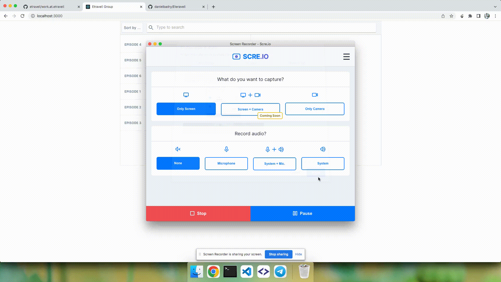

## Demo

## Available Scripts

In the project directory, you can run:

### `yarn start`

Runs the app in the development mode.\
Open [http://localhost:3000](http://localhost:3000) to view it in the browser.

### `yarn e2e`

Launches the test runner in the interactive watch mode.We wrote some e2e test in project

### `yarn build`
Build project into build folder
